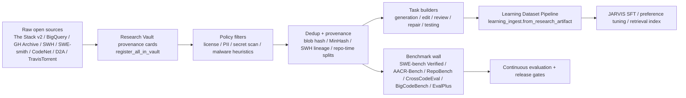
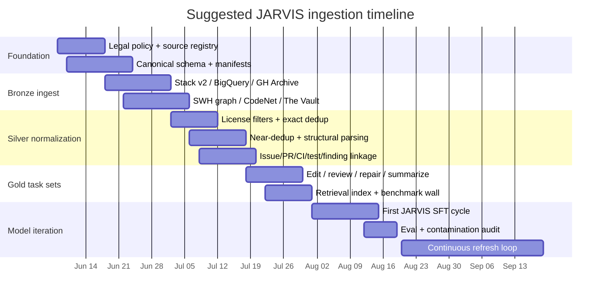

# Top Open Data Sources for Training JARVIS

> A curated, ranked inventory of publicly available, license-aware datasets
> Hermes can consume for JARVIS fine-tuning, preference training, retrieval,
> and evaluation. Companion to
> [`jarvis-learning-dataset.md`](jarvis-learning-dataset.md) (the *owned-trace*
> pipeline) and to [`open-data-sources.yaml`](open-data-sources.yaml) (the
> machine-readable registry behind this doc). The registry is loaded by
> [`hermes_cli/jarvis_prime/open_data_sources.py`](../../hermes_cli/jarvis_prime/open_data_sources.py)
> and surfaced via `python -m hermes_cli.jarvis_prime data-sources`.

As of 2026-06-04.

## Why this inventory exists

JARVIS improves through two complementary data paths:

1. **Owned traces** — its own validated, source-backed work (coding tasks,
   research answers, evidence checks, reviews, even failures), captured by the
   [JARVIS Learning Dataset Pipeline](jarvis-learning-dataset.md).
2. **External open data** — public, license-clear corpora and benchmarks. This
   document catalogs that second path.

For a code-focused agent, the strongest open-data strategy is not a single
corpus but a **layered stack**: a large, license-aware code base for breadth;
repository history and GitHub event streams for provenance and workflow
context; specialized edit/repair/review/CI/static-analysis corpora for
high-signal supervision; and a strict **benchmark wall** that stays out of
training. The inventory below feeds the **Research Vault**
([`research_vault.py`](../../hermes_cli/jarvis_prime/research_vault.py)) so
every external source carries provenance and an evidence strength, and so the
learning pipeline can cite it via `learning_ingest.from_research_artifact`.

## How sources are ranked

Sources are ranked by five factors that matter for an **agent**, not just a
code model:

1. **Repository-level realism** — does it expose real repo context, issues,
   PRs, tests, and CI rather than isolated functions?
2. **Provenance and legal clarity** — known license, attributable origin,
   honored removals.
3. **Signal density** for edits, review, repair, and testing.
4. **Benchmark quality** — is it a trustworthy held-out evaluation?
5. **Updateability** — can it be refreshed continuously?

A second ranking decision is to **separate training corpora from evaluation
corpora**. Public suites such as SWE-bench Verified, AACR-Bench, RepoBench,
CrossCodeEval, BigCodeBench, and EvalPlus are too important as held-out tests
to blend into supervised fine-tuning. Broad code + workflow + repair + CI +
static-analysis sources are better suited to scalable supervision and
retrieval.

## Ranked sources

Each row maps 1:1 to an entry in
[`open-data-sources.yaml`](open-data-sources.yaml) (keyed by `key`).

| Rank | Source (`key`) | Role | Legal posture | Size / languages | Best tasks & recommended subset |
|---|---|---|---|---|---|
| 1 | SWE-bench + Verified (`swe-bench`) | eval (both) | verify at ingest | 2,294 tasks; Verified = 500; Python | Bug fixing, repo navigation, test-aware repair. **Keep Verified eval-only.** |
| 2 | The Stack v2 (`the-stack-v2`) | train | mixed (incl. `no_license`) | 3.28B files, 67.53 TB, 658 langs | Base code pretraining, retrieval. **Permissive-only; exclude `no_license`/generated/vendor.** |
| 3 | GH Archive (`gh-archive`) | train | verify at ingest | hourly GitHub timeline since 2011 | Issue/PR linking, review-thread mining, continual refresh. |
| 4 | GitHub BigQuery (`github-bigquery`) | train | mixed | >2.8M repos, ~2B files | Repo snapshots, tests/docs extraction, dep/file-graph mining. **Permissive repos.** |
| 5 | Software Heritage Graph (`software-heritage-graph`) | train | CC BY 4.0 (graph only) | >5B files, >1B commits, >80M projects | Provenance, dedup anchors, temporal splits. Canonical lineage layer. |
| 6 | SWE-smith (`swe-smith`) | train | MIT | 50,137 tasks, 128 repos; Python | Agent SFT/RL for localization + repair. **Hold out target/benchmark repos.** |
| 7 | AACR-Bench (`aacr-bench`) | eval | Apache-2.0 | 200 PRs, 50 projects, 10 langs | Code review, defect finding. **Eval-only.** |
| 8 | CommitPackFT (`commitpackft`) | train | verify at ingest | 2 GB, 277 langs | Code edit, commit summarization, instruction edits. **High-quality-message shards.** |
| 9 | Project CodeNet (`project-codenet`) | train | CDLA-Permissive 2.0 | 13.9M submissions, 4,053 problems, 55 langs | Synthesis, translation, testing, wrong-answer→accepted repair. |
| 10 | The Vault (`the-vault`) | train | MIT (tooling) | 43M code-text pairs, 10 langs | Summarization, NL↔code, doc generation. |
| 11 | CodeSearchNet (`codesearchnet`) | train | mixed | ~2M pairs, 6 langs | Retrieval, summarization. Keep challenge labels for eval. |
| 12 | CodeXGLUE (`codexglue`) | eval | mixed (composite) | 14 datasets / 10 tasks | Eval wall + light auxiliary multitask. **Mostly eval-only.** |
| 13 | Defects4J (`defects4j`) | train | MIT | 854 Java bugs, 17 projects | Java repair + regression validation. Hold out full projects. |
| 14 | BugsInPy (`bugsinpy`) | train | verify at ingest | 493 bugs, 17 Python projects | Python repair, debugging, test reasoning. |
| 15 | D2A (`d2a`) | train | Apache-2.0 | C/C++ static-analysis corpus | Static-analysis ranking, vuln triage. High-confidence positives + after-fix negatives. |
| 16 | TravisTorrent (`travistorrent`) | train | verify at ingest | 100Ks of Travis builds | CI summarization, failing-build diagnosis. Failed→fixed chains. |
| 17 | RepoBench (`repobench`) | eval | verify at ingest | Python + Java, 3 tasks | Long-context completion + retrieval eval. **Eval-only.** |
| 18 | CrossCodeEval (`crosscodeeval`) | eval | Apache-2.0 | Python/Java/TS/C# | Retriever tuning, cross-file completion eval. **Eval-only.** |
| 19 | BigCodeBench (`bigcodebench`) | eval | Apache-2.0 | 1,140 tasks, 139 libs | Tool use, library reasoning eval. **Eval-only.** |
| 20 | EvalPlus (`evalplus`) | eval | verify at ingest | HumanEval+ (164), MBPP+ (378) | Final regression gate only. **Out of training.** |
| 21 | Stack Overflow / Stack Exchange dump (`stackexchange-dump`) | excluded | `no_llm_training` | full network dump | **Do not ingest for training** (see caveat below). |

See [`open-data-sources.yaml`](open-data-sources.yaml) for the full per-source
detail (schema/provenance, strengths, biases, and canonical URIs).

## Core ingest set vs. benchmark wall

If you want a narrow "best data to actually train on" slice, the recommended
**core ingest set** (`core_ingest: true`) is:

> The Stack v2, GitHub BigQuery, GH Archive, Software Heritage Graph,
> SWE-smith, Project CodeNet, The Vault, CommitPackFT, D2A, TravisTorrent.

Everything else is either a specialist fine-tune source (CodeSearchNet,
Defects4J, BugsInPy) or a held-out evaluation asset.

The **benchmark wall** (`benchmark_wall: true`) is preserved for evaluation
only and **must never enter train/val**:

> SWE-bench Verified, AACR-Bench, RepoBench, CrossCodeEval, BigCodeBench,
> EvalPlus.

By construction the core-ingest set and the benchmark wall are **disjoint** —
the registry loader and tests enforce that a source is never in both at once.



## How this maps to the hermes-agent pipeline

This inventory is not a new ingestion stack — it routes external sources
through the systems Hermes already ships. The four hard gates every example
must clear map onto existing modules:

1. **Legal gate** — license status known, provenance attached, removals
   honored, `no_license`/ambiguous-source files quarantined. Each source's
   `legal_posture` + `license_notes` live in the registry; the Research Vault
   stores `license_notes` and an `EvidenceStrength` per artifact
   ([`research_vault.py`](../../hermes_cli/jarvis_prime/research_vault.py)).
   Sources flagged `no_llm_training` (the Stack Overflow dump) are **skipped by
   default** by `register_all_in_vault`.
2. **Parsing / execution gate** — code parses and benchmarks run in a sandbox;
   tests/build steps are reproducible. Reuse the verification gates in
   [`docs/jarvis-verification-gates.md`](../jarvis-verification-gates.md)
   (Build / Test gates).
3. **Content-safety gate** — secret scanning, PII redaction, and malware
   filtering. The learning pipeline already enforces this at write time:
   `redact_sensitive_text(force=True)`, residual-secret rejection, raw
   chain-of-thought stripping, and an unlicensed-bulk-scrape refusal
   ([`learning_dataset.py`](../../hermes_cli/jarvis_prime/learning_dataset.py),
   summarized in [`jarvis-learning-dataset.md`](jarvis-learning-dataset.md)).
4. **Decontamination gate** — any repo/task/near-duplicate overlapping the
   benchmark wall is excluded from train/val and preserved for evaluation only.
   The wall is a first-class registry partition (`benchmark_wall: true`).

**Dedup guidance (starting thresholds, not standards):** exact dedup on git
blob SHA / file-content hash / SWH content identifiers; near-dedup in two
passes — file-level MinHash over identifier-normalized token shingles at ~0.90,
function-level AST/token-shingle similarity at ~0.85; cluster similar unified
diffs at ~0.80. The Stack v2 reports large duplicate mass and Project CodeNet
ships duplicate/problem-cluster controls, so aggressive dedup matters more than
usual here.

**Continuous-update cadence:** refresh GH Archive hourly/daily (it is already
hourly); GitHub BigQuery-derived corpora weekly; The Stack v2 in sync with its
~quarterly removal/update cycle; Software Heritage on its yearly graph
releases; and generate SWE-smith tasks on *your* target repos per-release —
that is the best path to align JARVIS with the repos you actually care about.



## Using the registry

```
# Browse the inventory
python -m hermes_cli.jarvis_prime data-sources list
python -m hermes_cli.jarvis_prime data-sources list --core   # core ingest set
python -m hermes_cli.jarvis_prime data-sources list --wall   # eval-only wall
python -m hermes_cli.jarvis_prime data-sources show the-stack-v2

# Bridge sources into the Research Vault as provenance cards
python -m hermes_cli.jarvis_prime data-sources register-vault --dry-run
python -m hermes_cli.jarvis_prime data-sources register-vault
```

`register-vault` records each source as a Research Vault artifact (source URI,
evidence strength, license notes) and **never downloads a dataset**. From there
the existing pipeline can mint source-backed traces via
`learning_ingest.from_research_artifact`.

## Stack Overflow / Stack Exchange caveat

One source many teams instinctively reach for is **Stack Overflow / Stack
Exchange**, but it is **not** recommended for JARVIS via the public dump path.
Stack's download terms now require users to affirm they will not use the dump
for LLM training, and Stack offers a separate AI data-licensing route instead.
For this use case that makes the public dump legally and operationally inferior
to the other open sources here. It is registered with
`legal_posture: no_llm_training` and **quarantined from training by default** —
`register_all_in_vault` skips it unless `--include-restricted` is passed.

## Compliance and limitations

- **Permissive-only by default.** Ingest non-permissive sources only when a
  dataset carries a clearly separate, AI-appropriate data license (e.g.
  CDLA-Permissive 2.0).
- **Row-level provenance.** Preserve original-license metadata and origin; the
  Research Vault stores `source_uri`, `evidence_strength`, and `license_notes`
  per artifact.
- **Quarantine `no_license`** files; apply opt-out/removal updates from sources
  like The Stack v2.
- **Scan for PII/secrets** — public code corpora can contain emails, API keys,
  and other sensitive content. Execute all tests and generated code in a
  sandbox.
- **Unconfirmed licenses.** For some sources the exact redistribution license
  was not visible in the source material — notably BugsInPy, RepoBench,
  TravisTorrent, and a few benchmark repos. These carry
  `legal_posture: verify_at_ingest` and **must be re-verified before
  mirroring**. AACR-Bench's canonical repo URL is likewise unconfirmed; its
  registry entry uses a `registry://` placeholder URI until verified.
- The report this inventory derives from searched for a mistyped
  "HERMAS-AGENT" and did not find an exact public match; this repo is
  **hermes-agent**, so that repo-search section is intentionally omitted here.
