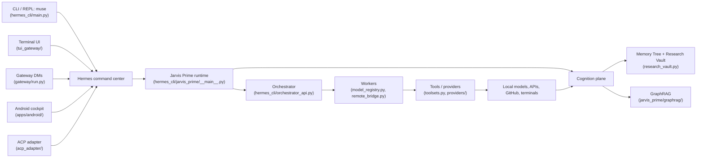
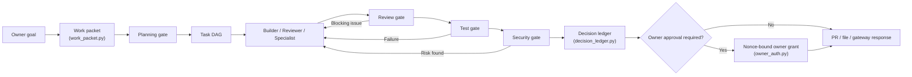
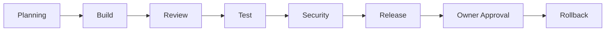
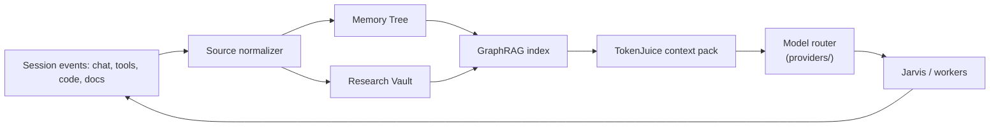
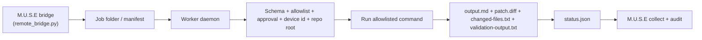
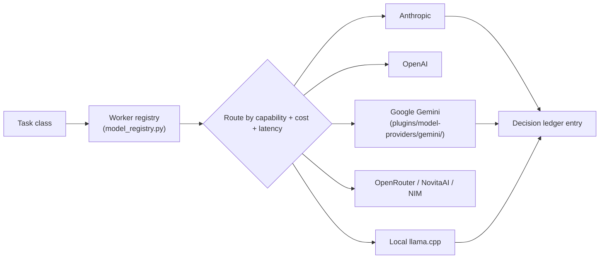

# M.U.S.E Dataflow

How the components in the [component registry](MUSE_COMPONENT_REGISTRY.md) pass
data — from a surface, through the Jarvis Prime runtime and the cognition plane,
out to workers and tools, and back. Module names below match real code in the
repository.

## 1. Context — surfaces into the brain

The **surface** changes how the prompt gets in and the answer comes back; the
**backend** is the same brain regardless of surface.

## 2. Goal-to-PR workflow

## 3. The eight-gate control chain

The gates are implemented in
[`hermes_cli/jarvis_prime/gates.py`](../../hermes_cli/jarvis_prime/gates.py) and
specified in [`../jarvis-verification-gates.md`](../jarvis-verification-gates.md).
In strict evidence mode each observation gate must produce a captured artifact
(git diff, review, test result, secret scan, owner grant, rollback) rather than a
self-attested packet field.

## 4. Cognition + GraphRAG

Memory stays **provenance-bound**: it preserves sourced claims, confidence,
sensitivity, contradiction reports, and supersession status, but is never the
sole source of truth. GraphRAG *supplements* RAG/memory; it does not replace it
(see [`../jarvis_architecture/GRAPHRAG_KNOWLEDGE_GRAPH.md`](../jarvis_architecture/GRAPHRAG_KNOWLEDGE_GRAPH.md)).

## 5. Remote worker bridge

The remote worker only executes allowlisted commands, only inside configured repo
roots, only after approval, while writing structured artifacts back to the shared
workspace. Phase state machine: `todo → ready → in_progress → validating → done`.
See [MUSE_WORKFLOW_SCHEMAS.md](MUSE_WORKFLOW_SCHEMAS.md) and
[`../remote/windows-claude-code-bridge-guide.md`](../remote/windows-claude-code-bridge-guide.md).

## 6. Model routing

Providers self-register lazily through
[`providers/__init__.py`](../../providers/__init__.py); routing decisions land in
the decision ledger so every model choice is auditable. See the
[technology disposition](MUSE_TECHNOLOGY_DISPOSITION.md) for which backends are
adopted vs. evaluated-and-declined.
