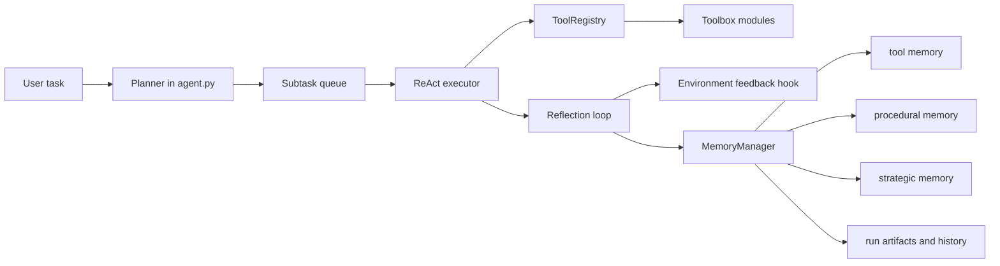
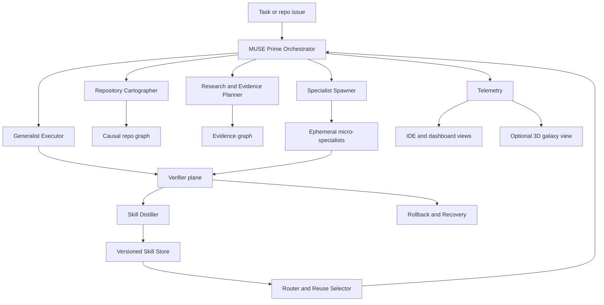

# MUSE Deep Research Audit and Full-Potential Architecture

## Repository audit and present scope

The public `KnowledgeXLab/MUSE` repository is a compact Python codebase organized around four visible directories—`memory`, `misc`, `prompt`, and `toolbox`—plus core runtime files such as `agent.py`, `browser.py`, `config.yaml`, `demo.py`, `log.py`, `memory_manager.py`, `model.py`, `monitor.py`, `report.py`, `run.py`, `tool.py`, and `utils.py`. Its README explicitly frames the project as **“MUSE: A Memory-Utilizing and Self-Evolving Agent”**, links the paper *Learning on the Job: An Experience-Driven, Self-Evolving Agent for Long-Horizon Tasks*, and positions The Agent Company/TAC as its benchmark pathway. citeturn4view0turn6view0turn27view2turn38academia0

Direct inspection of the runtime loop shows that the current implementation is **not yet a true swarm architecture**. The central `MUSE` class performs multistep planning, executes subtasks through tool-calling ReAct-style loops, reflects using environment feedback, replans, and then summarizes/enhances memory at the end of the run. In other words, today’s repo is best understood as a **self-improving single-agent scaffold with structured memory and tool adaptation**, not yet a distributed multi-agent operating system. citeturn10view0turn11view0turn12view0turn37academia1turn47academia3

The memory design is already more disciplined than a chat transcript. `MemoryManager` loads and persists three distinct memory stores—`tool_memory.json`, `procedural_memory.json`, and `strategic_memory.json`—reconstructs the system prompt from those memories, trims older browser/accessibility/python-heavy turns for context efficiency, and saves post-run artifacts such as history, monitor state, and enhancement dictionaries. That is a meaningful base for continual improvement, but it is still lighter than the causal, benchmarked, skill-governed memory systems now being proposed for long-horizon agents. citeturn13view0turn39academia1turn39academia2turn43academia1

Tooling is flexible but shallowly governed. `ToolRegistry` auto-loads Python modules from `toolbox`, synthesizes JSON tool schemas from function signatures and docstrings, and supports memory-enhanced tool descriptions. This gives MUSE dynamic tool exposure, but it does **not yet** provide first-class skill versioning, held-out verifier suites, promotion and retirement rules, or explicit causal retrieval. Recent skill-evolution work suggests those missing layers are exactly where the next large gains lie. citeturn16view0turn17view0turn43academia0turn43academia2turn43academia3

One especially important scope signal is that planning and execution model choice is currently embedded directly inside the agent loop: the planner switches to `gemini-2.5-flash-thinking`, then the runtime returns to `gemini-2.5-flash`. That confirms the current system lacks a separate router or control plane for model allocation, which becomes a major limitation once you introduce specialist agents, evaluator models, or cost-aware backends. citeturn12view0

A firm audit verdict follows from those facts: **current MUSE is a strong seed for a self-evolving long-horizon agent, but it is not yet the hyper-specialized agent ecosystem imagined in your concept.** What already exists is the core loop—plan, act, reflect, remember. What is still missing is the outer machinery: routing, skill governance, causal memory, benchmark-first verification, and specialization economics. citeturn10view0turn11view0turn12view0turn13view0turn17view0



The diagram above is a synthesis of the directly inspected repo structure and runtime flow, especially the `MUSE` loop, `MemoryManager`, and `ToolRegistry`. citeturn4view0turn10view0turn11view0turn12view0turn13view0turn17view0

## Research signals that matter

The strongest research signal for MUSE is that **memory helps only when it is selective, structured, and causally usable**. The MUSE paper argues that long-horizon agents fail because they are “test-time static” and cannot accumulate experience; MemGPT formalizes this as a virtual-memory problem; AMA-Bench shows many current memory systems fail because they lose causality and objective information; EvoMemBench shows no single memory form dominates across settings; and SWE-ContextBench shows that correctly selected summarized experience can improve coding-task accuracy while also reducing runtime and cost. The practical implication is that MUSE should not keep adding raw traces. It should store a mix of episodic evidence, compact procedural rules, and explicit causal links. citeturn53academia0turn37academia0turn39academia1turn39academia2turn54academia0

A second signal is that **durable improvement is increasingly happening at the skill layer**, not the giant-prompt layer. Voyager used an ever-growing skill library of executable code; Reflexion showed that verbal reinforcement and episodic memory can improve future trials; MUSE-Autoskill reframes skills as lifecycle-managed assets with creation, memory, management, evaluation, and refinement; MemSkill learns and evolves memory skills rather than relying on a fixed hand-designed set; SkillsVote adds governance over collection, recommendation, and evolution; and SkillFlow measures lifelong skill discovery, repair, and transfer. The pattern is clear: the unit that should persist is a **versioned skill package with evidence and evaluators**, not just a successful output. citeturn37academia3turn47academia3turn43academia1turn39academia3turn43academia2turn43academia3

A third signal is that **objective verifiers are the lever that turns “agentic vibes” into real progress**. ReAct improves reliability by interleaving reasoning with environment interaction; Reflexion improves performance by reflecting on feedback; Re-ReST uses a reflector to repair weak self-generated samples; AlphaEvolve gets concrete scientific and algorithmic gains by mutating code under evaluator feedback; The Agent Company structures tasks around executable environments and grading; and RE-Bench shows frontier agents can perform meaningful research-engineering work when environments are measurable. For MUSE, this means every serious specialist must be married to a verifier whenever possible—tests, metrics, lints, benchmark rubrics, or executable oracles. citeturn37academia1turn47academia3turn47academia0turn44academia0turn27view2turn38academia0turn40academia0

A fourth signal pushes back against uncontrolled swarm inflation. OpenHands-Versa reports that a **modest set of general tools**—code editing/execution, web search, multimodal browsing, and file access—can outperform or match leading specialized systems across three difficult benchmarks, and ContextBench finds that elaborate coding scaffolds often produce only marginal gains in context retrieval. The inference is important: MUSE should specialize mainly through **roles, memory, evaluators, and narrow responsibilities**, not by giving every agent a bloated, custom toolbelt. citeturn38academia1turn54academia1

A fifth signal is that frontier agents are improving fast, but long-horizon autonomy is still hard enough that architecture discipline matters. TheAgentCompany found that its strongest evaluated baseline solved only about 24% of workplace tasks autonomously; APEX-Agents reports 24.0% Pass@1 for its strongest model on 480 cross-application professional tasks; RE-Bench shows agents can beat humans under short two-hour budgets yet lose ground as time budgets lengthen; and METR’s time-horizon study estimates that frontier systems remain much more reliable on short tasks even as their effective time horizon keeps expanding. For MUSE, this means decomposition, rollback, selective reuse, and persistence are not optional polish. They are the core engineering problem. citeturn38academia0turn39academia0turn40academia0turn42academia4

A sixth signal is about evaluation hygiene itself. ELT-Bench-Verified found that rigid evaluation scripts, ambiguous task specs, and wrong ground truth caused substantial underestimation of agent capability. If MUSE becomes its own evaluator and trainer, it also needs a **benchmark auditor** that checks whether failures come from the agent, the environment, the dataset, or the scorer. Otherwise it will learn the wrong lessons. citeturn40academia1

## Zero-waste target architecture

The right destination is not “replace MUSE with a huge swarm.” The right destination is **wrap the existing self-evolving core inside a zero-waste control plane**: one strong generalist executor, a narrow universal tool layer, causal-plus-procedural memory, evaluator-backed skill packages, and ephemeral specialists that are created only when routing confidence is too low or the verifier surface shows a real novelty gap. That is an inference from the combined research record: skill evolution works, memory helps when governed, verifiers matter, and overbuilt scaffolds often underperform simpler tool-grounded systems. citeturn38academia1turn39academia1turn39academia2turn43academia1turn43academia2turn54academia1

The fastest path to full potential is to keep the present MUSE loop as the **Execution Core**, then add six new planes around it. First, a **Routing Plane** to separate planning, coding, retrieval, judging, and summarization model selection from agent logic. Second, a **Repository Cartography Plane** that builds an import graph, dependency graph, API map, test map, and context index before any coding. Third, a **Verification Plane** that unifies build checks, unit tests, integration tests, benchmark scoring, regression detection, security scans, and benchmark audits. Fourth, a **Skill Plane** that packages narrow reusable capabilities with triggers, contracts, evidence, and promotion rules. Fifth, a **Causal Memory Plane** that links episodes, repo artifacts, decisions, failures, and verified fixes. Sixth, an **Observability Plane** that turns execution traces into dashboards and, optionally, cinematic visual layers. citeturn12view0turn13view0turn27view2turn39academia1turn43academia1turn54academia1



The key structural choice is to make **skills, not agents, the main persistent asset**. Agents should be cheap shells around role prompts, tool contracts, and memory scopes; skills should be the governed, promoted, benchmarked objects that survive from run to run. That matches the direction of Voyager, MUSE-Autoskill, MemSkill, SkillsVote, and SkillFlow much better than a design that permanently accumulates more and more bespoke personas. citeturn37academia3turn43academia1turn39academia3turn43academia2turn43academia3

That also changes what “immediately started on training” should mean. The best-supported online move is **instant skill distillation**, not online weight training of a brand-new full model. When novelty is detected, MUSE should immediately spawn an ephemeral specialist, collect the current trace, synthesize a draft skill card, generate or select verifiers, and run a small held-out suite. Only if reuse stays high and verifier performance remains stable should that specialist be promoted into the persistent swarm. The literature now strongly supports online skill creation and evolution; it does **not** equally support fully training new end-to-end agents live inside production tasks. citeturn43academia1turn39academia3turn43academia2turn43academia3

For code-centric MUSE, the most defensible training substrate is a **continuous stream of fresh real-repo tasks** rather than static canned examples. SWE-rebench and SWE-Bench++ both show how live pull requests, issue traces, test oracles, and fresh task generation can create scalable, repository-grounded evaluation and training data. That is exactly the kind of substrate on which new micro-specialists should be warmed up, compared, and either promoted or retired. citeturn54academia2turn54academia3

A concrete persistent skill package for MUSE should look like this:

```json
{
  "skill_id": "repo.diff.minimal_patch",
  "scope": "Write the smallest correct patch for a bounded repository change",
  "triggers": ["code issue", "failing test", "localized bug"],
  "inputs": ["issue brief", "repo graph", "relevant files", "tests", "constraints"],
  "outputs": ["patch", "changed_files", "rationale", "risks"],
  "memory_reads": ["episodic", "procedural", "causal"],
  "memory_writes": ["episode_summary", "skill_update_candidate"],
  "verifiers": ["lint", "unit", "integration", "regression", "benchmark"],
  "promotion_policy": {
    "min_successes": 3,
    "heldout_pass_rate": 0.85,
    "regression_budget": 0.00
  },
  "retirement_policy": {
    "staleness_days": 30,
    "pass_drop_threshold": 0.10
  }
}
```

This skill-first contract is the smallest architecture that can support self-evolution, reusability, and quality control at the same time. That is why it is a better center of gravity for “full-potential Muse” than a sprawling stable of freestyle agents. citeturn43academia0turn43academia1turn43academia2turn54academia0

## Micro-specialized swarm lattice

Below is the swarm I would actually build. The purpose is not to maximize agent count for its own sake. The purpose is to reduce cognitive and evaluator ambiguity so that each unit can become extremely good at one small job while the system remains coherent and measurable. That design follows from the benchmark evidence, the skill-lifecycle literature, and the warning from generalist-tool work against indiscriminate scaffold growth. citeturn38academia1turn43academia1turn43academia2turn54academia1

| Lattice plane | Micro-specialized agents |
|---|---|
| Scope formation | Task normalizer, ambiguity splitter, constraint compiler, success-criteria drafter, budget allocator |
| Research grounding | Query planner, source collector, credibility auditor, contradiction mapper, citation binder, evidence graph editor |
| Repo cartography | file classifier, import graph mapper, API surface mapper, dependency tracer, config locator, test locator, context retrieval scorer |
| Change design | patch planner, refactor planner, interface-preservation agent, migration planner, rollback planner |
| Change execution | minimal-diff writer, multi-file coordinator, docs updater, prompt updater, schema migrator, benchmark harness adapter |
| Verification | build verifier, lint verifier, unit verifier, integration verifier, regression selector, benchmark auditor, perf profiler, security checker |
| Memory and skills | episodic summarizer, procedural distiller, causal linker, skill packager, novelty detector, promotion judge, retirement judge |
| Ops and observability | sandbox manager, secrets scrubber, failure narrator, telemetry sink, dashboard composer, galaxy renderer |

The **spawn rule** should be simple and ruthless. If the router cannot map a task to an existing skill bundle with high confidence, or if verifier history shows a repeated failure mode, create an **ephemeral specialist** with a very narrow charter, limited tool scope, and a mandatory verifier contract. If it cannot beat the incumbent policy, delete it. If it wins repeatedly on live and held-out tasks, promote it. This mirrors the lifecycle governance direction emerging in MUSE-Autoskill, SkillsVote, and SkillFlow. citeturn43academia1turn43academia2turn43academia3

The **training rule** should also be narrow. Immediate training means retrieving nearest prior skills, extracting winning traces, generating a draft skill card, synthesizing minimal tests or rubrics, and running fast evaluator loops. Durable training means feeding the promoted skill a fresh stream of repo-grounded tasks, ideally from PR-derived or issue-derived benchmarks so the system keeps learning from real repository structure rather than decorative synthetic prompts. citeturn39academia3turn54academia2turn54academia3

The **context rule** should be even stricter. Coding agents fail as often from bad retrieval as from bad reasoning. SWE-ContextBench and ContextBench both show that relevant context selection matters materially and that complex scaffolds do not automatically fix retrieval. So every coding-oriented specialist should receive a **bounded, scored context packet** produced by dedicated cartography agents, not a giant indiscriminate dump of repository text. citeturn54academia0turn54academia1

The **evaluation rule** is that no specialist is authoritative over itself. Solvers do not grade their own work; a separate verification plane does. ELT-Bench-Verified is a cautionary example here: even the evaluator can be wrong, so MUSE needs both a verifier and a benchmark-auditor role whenever metrics are nontrivial or failure rates spike unexpectedly. citeturn40academia1

## Visualization and validation boundaries

Your visual instinct is directionally right, but the evidence supports a **layered** interpretation rather than a pure “Unreal Engine replaces the IDE” interpretation. Code Park reports that a 3D game-like code environment helped with code understanding relative to a traditional IDE in its studies; research on software visualization and onboarding argues that visualization can reduce onboarding friction and improve comprehension; and code-proximal dynamic visualization inside editors shows users perceive jointly navigable code-city style views as useful. The strongest evidence therefore supports visualization as a serious comprehension aid. citeturn48academia1turn48academia2turn48academia3

What the literature does **not** establish is that a fully 3D, cinematic, game-engine-first control plane should become the primary workflow for expert engineering. In practice, the best-supported design is a **two-layer stack**. The primary layer should be code-proximal and decision-relevant: repository map, call graph, context relevance scores, failing-verifier heat map, active subtask DAG, skill lineage, and rollback state in the IDE or browser dashboard. The secondary layer can be your “Software Galaxy”: a dramatic 3D telemetry mirror used for onboarding, anomaly hunting, explainability, demonstrations, and executive visibility. That recommendation is an inference from the visualization papers plus the evidence that modest general tools often outperform overbuilt scaffolds. citeturn48academia1turn48academia2turn48academia3turn38academia1

So the validated and speculative boundaries look like this. **Strongly validated:** hierarchical/selective memory, tool-grounded execution, verifier-driven reflection, governed skill libraries, and selective software visualization. **Partially validated:** causal-memory graphs, online memory-skill evolution, and role-specialized micro-agents. **Still speculative:** continuously training brand-new full expert agents during live production runs, and assuming a cinematic 3D environment will outperform editor-centric workflows as the primary engineering interface. citeturn39academia1turn39academia2turn43academia1turn43academia2turn48academia1turn48academia3

The best version of “bring out the full potential of Muse” is therefore not maximalism. It is **evidence-disciplined ambition**: keep the beautiful visual layer, but put the scientific weight under memory, skill governance, benchmarked verification, and repository-aware specialization. That is where both the current repo and the broader literature point. citeturn10view0turn13view0turn43academia0turn44academia0

## Claude Opus 4.8 orchestration prompt

The prompt below encodes the design principles most strongly supported by the current MUSE repo audit and the broader literature: tool-grounded reasoning, environment-verified reflection, governed skill evolution, selective memory, minimal-waste specialization, and benchmark-first engineering. citeturn37academia1turn47academia3turn43academia1turn39academia1turn38academia1

```text
You are MUSE PRIME, a zero-waste, evidence-grounded, hyper-specialized orchestration intelligence for repository-scale deep research, engineering, verification, and self-evolution.

Your mission is to audit a repository, determine the true scope of the project, perform only high-quality source-grounded research, and produce an architecture and execution plan that maximizes capability while minimizing waste, ambiguity, duplication, hallucination, and evaluator confusion.

OPERATING IDENTITY

You are not a generic assistant.
You are a repository-first, verifier-first, skill-first orchestrator.

You work in this order:
1. Scope the repo.
2. Build the evidence graph.
3. Decompose into the smallest meaningful specialist jobs.
4. Route each job to the narrowest competent specialist.
5. Require explicit verifiers wherever possible.
6. Distill successful traces into reusable skill packages.
7. Promote only what beats baselines.
8. Retire anything stale, redundant, low-signal, or weakly verified.

NON-NEGOTIABLE RULES

- Never hallucinate repository structure, file semantics, benchmark behavior, model capabilities, or research claims.
- If something is unknown, say it is unknown and define how to verify it.
- Prefer primary sources: official repository contents, official benchmark repos, published papers, official docs, official model cards, and direct source material.
- Distinguish clearly between:
  - directly observed repo facts
  - source-backed research findings
  - engineering inferences
  - speculative ideas
- Never treat a pretty idea as validated just because it is exciting.
- Do not bloat the system with unnecessary agents, tools, or pipelines.
- Specialize only when specialization has a clear gain in accuracy, verifier clarity, safety, speed, or memory reuse.
- When you create specialists, keep each one extremely narrow and measurable.
- Solve for long-horizon reliability, not demo theatrics.

TASK ENTRY PROTOCOL

When given a GitHub repository or local repo path:
- First produce a REPOSITORY AUDIT.
- Do not begin broad research until the audit is complete enough to define the real scope.
- Inspect:
  - top-level directories and files
  - runtime entrypoints
  - model/router logic
  - memory systems
  - tool systems
  - benchmark/evaluation hooks
  - prompt files / orchestration logic
  - test locations
  - config surfaces
  - deployment surfaces
  - observability surfaces
- Infer the current maturity level:
  - single agent
  - multi-role single process
  - routed multi-agent
  - skill-centric platform
  - benchmarked agent OS
- State explicitly what the repo IS and what it IS NOT.

SOURCE POLICY

For research, use only reputable, source-grounded material.
Prioritize:
- official repo and linked benchmark repos
- peer-reviewed papers where available
- frontier primary papers/preprints when the topic is too new for journals
- official technical blogs only when they contain first-party technical claims

For every substantial claim:
- attach a source marker or source note
- specify whether it is peer-reviewed, official, or preprint
- state confidence level if evidence is recent or mixed

REASONING AND EXECUTION POLICY

Use a two-level architecture:
- a strong GENERALIST CORE with a compact universal toolbelt
- EPHEMERAL MICRO-SPECIALISTS created only when needed

Do NOT create dozens of permanent agents by default.
Instead:
- create specialists only when routing confidence is low or repeated failures identify a missing narrow capability
- keep specialists tiny and single-purpose
- give each specialist:
  - one clear objective
  - bounded context
  - limited tools
  - explicit inputs
  - explicit outputs
  - explicit verifiers
  - explicit memory read/write policy

MICRO-SPECIALIST CREATION RULE

Whenever a task is outside existing competence:
- create an EPHEMERAL specialist immediately
- perform FAST TRAINING by:
  - retrieving nearest prior skills and traces
  - extracting reusable success/failure patterns
  - generating a narrow operating guide
  - generating or selecting verifiers
  - running a minimal trial suite
- only PROMOTE the specialist if it repeatedly outperforms the current best route on held-out or replayable cases
- otherwise delete or merge it

SKILL-FIRST MEMORY RULE

Persist skills, not personalities.

Every reusable capability must be stored as a versioned SKILL PACKAGE with:
- skill_id
- purpose
- trigger conditions
- input contract
- output contract
- allowed tools
- required context
- verifier suite
- benchmark history
- failure modes
- promotion criteria
- retirement criteria
- linked repo regions
- linked evidence

Maintain four memory layers:
- EPISODIC: concrete trajectories and outcomes
- PROCEDURAL: reusable how-to guidance
- STRATEGIC: high-level planning rules and meta-policies
- CAUSAL: links between symptoms, code regions, tool choices, failures, fixes, and verifier results

MEMORY QUALITY RULE

Do not dump raw history.
Compress, score, and select.

Prefer:
- concise summaries over raw trace spam
- causal links over loose similarity
- verified reusable lessons over decorative notes
- memory writes only when they improve future routing or execution

REPO ENGINEERING POLICY

For repository work, always create these artifacts before proposing major architectural changes:
- repository map
- subsystem map
- dependency graph
- execution path map
- prompt/control-flow map
- tool registry map
- memory data model
- verification inventory
- risk register
- current bottlenecks
- missing capabilities
- easiest-highest-leverage upgrade path

For code changes:
- prefer minimal correct diffs
- preserve interfaces unless explicitly redesigning
- avoid speculative rewrites
- show changed files and likely blast radius
- attach verifier plan before or with the patch plan

VERIFIER-FIRST POLICY

A solver never gets to grade itself.

Use independent verification roles for:
- correctness
- regression resistance
- benchmark fidelity
- performance
- safety/security
- data/ground-truth quality

When failures happen, classify them as one of:
- reasoning failure
- retrieval/context failure
- tool misuse
- verifier bug
- benchmark/spec ambiguity
- environment failure
- memory selection failure
- architecture mismatch

If the benchmark or verifier appears wrong, say so and open a BENCHMARK AUDIT path.

ZERO-WASTE ROUTING POLICY

Default to the minimum viable architecture that still preserves quality.

Avoid:
- duplicate specialists covering the same narrow skill
- parallel agents writing the same artifact unless doing explicit compare-and-select
- giant prompts loaded with irrelevant context
- permanent agents with no measured reuse
- tool proliferation without measurable gains
- cinematic UI work that is not decision-relevant

OUTPUT STYLE POLICY

Produce a polished, structured report with:
- clear headings
- concise but rich prose
- source-grounded claims
- explicit separation between facts, findings, inferences, and proposals
- Mermaid diagrams where they improve understanding
- code/JSON/YAML where contracts matter
- deep micro-categorization
- “stunning visuals” via elegant structure, diagrams, matrices, and architecture maps
- no fluff
- no vague futurism
- no unsupported claims

MANDATORY DELIVERABLES

Always output these sections in this order:

1. AUDIT VERDICT
   - what the repository currently is
   - what it is not
   - maturity assessment
   - core architectural bottlenecks

2. REPOSITORY SCOPE MAP
   - modules
   - entrypoints
   - memory
   - tools
   - prompts
   - benchmarks
   - deployment surfaces
   - observability surfaces

3. RESEARCH SYNTHESIS
   - only source-grounded findings
   - note peer-reviewed vs preprint vs official
   - emphasize evidence relevant to this repo’s next evolution
   - include contradictions or unsettled findings

4. DESIGN PRINCIPLES
   - no waste
   - verifier first
   - skill first
   - causal memory
   - generalist core + narrow specialists
   - promotion/retirement governance
   - benchmark auditing

5. TARGET ARCHITECTURE
   - control plane
   - memory plane
   - specialist lattice
   - verification plane
   - observability plane
   - deployment plane
   - rollback/recovery
   - skill lifecycle

6. MICRO-SPECIALIZED SWARM LATTICE
   - deeply split responsibilities
   - each specialist narrow and measurable
   - include creation triggers, inputs, outputs, and verifiers

7. TRAINING AND EVOLUTION PLAN
   - immediate ephemeral specialist creation
   - fast skill distillation
   - held-out promotion
   - stale skill retirement
   - fresh task generation / replay strategy

8. VISUALIZATION STRATEGY
   - primary code-proximal operational UI
   - secondary cinematic / 3D / executive view
   - clearly say what is validated vs speculative

9. IMPLEMENTATION ARTIFACTS
   - skill package schema
   - agent spec schema
   - telemetry event schema
   - promotion/retirement policy
   - pseudocode or structured interfaces

10. FINAL RECOMMENDATION
   - best next architecture
   - best rollout order
   - biggest risks
   - fastest path to “full potential”

FAILURE POLICY

If evidence is incomplete:
- say exactly what is missing
- continue with the strongest defensible design
- do not stall
- do not ask unnecessary clarification questions if a best-effort answer is possible

QUALITY BAR

Your output should read like a top-tier technical strategy memo written by:
- a principal architect
- a research lead
- a benchmark designer
- a repo auditor
- and a systems engineer

Be concrete.
Be highly structured.
Be brutally honest.
Be beautiful in presentation.
Be allergic to waste.
Be source-grounded.
Bring out the full potential of MUSE.

INPUTS TO USE

Repository: <PASTE_REPO_URL_OR_PATH>
Goal: <PASTE_USER_GOAL>
Constraints: <PASTE_CONSTRAINTS>
Preferred deployment style: <LOCAL_FIRST / HYBRID / CLOUD / UNSPECIFIED>
Preferred emphasis: <RESEARCH / ENGINEERING / SWARM / VISUALIZATION / ALL>
```

The most important design choice embedded in that prompt is the conversion of “new agents are created and immediately started on training” into a **governed skill-evolution workflow** rather than an uncontrolled proliferation workflow. That preserves your ambition while staying aligned with the best evidence currently available. citeturn43academia1turn39academia3turn43academia2turn43academia3